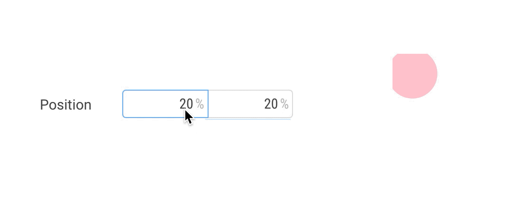
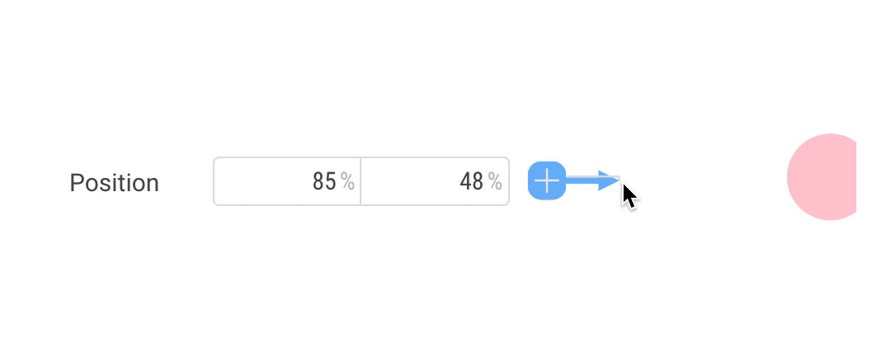
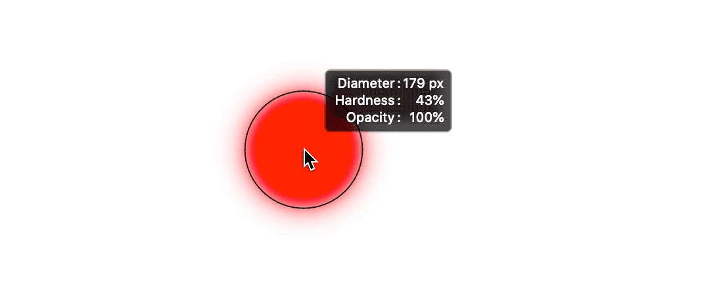
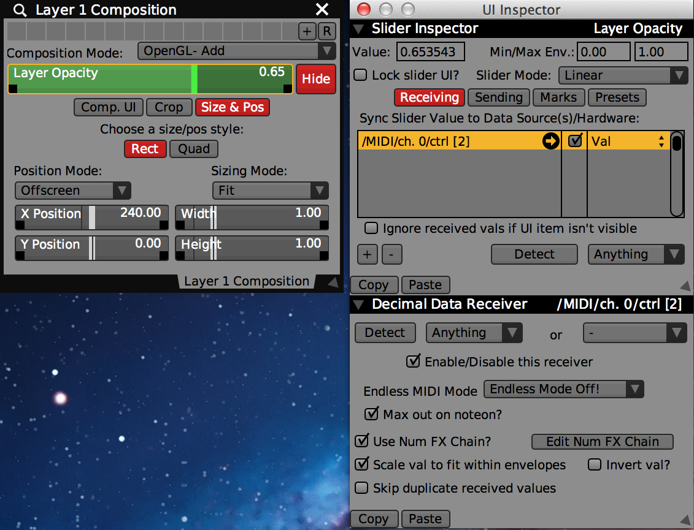

# インターフェースの帯域

<small>※ ここでは、「帯域幅」という表現を使っていますが、おそらく こういった概念にはもっと適切な名前がつけられていそうな気もします。Human Computer Interaction 方面で知っている方がいれば、どなたか教えて下さい…。</small>

## 帯域と使い勝手

インターフェースは、文字通りユーザーとプログラムとをつなぐ、橋渡しの役割を果たしています。インターフェースを介することで、ユーザーの体の動きからある量を読み取ってプログラムに伝え、プログラムが出力したデータをなにがしの方法で人の感覚器官へとフィードバックすることができます。

### インターフェースが介する情報量

このとき、このユーザー入力に具体的にどのような情報がどのくらい含まれているかを考えてみます。例えば昔ながらの 1 ボタンマウスは、利き手の 20 近くの関節が生み出す物理量を「X, Y という２つの連続量」「クリックされたかどうかの真偽値」という情報に畳み込み、画面上のポインタの動きと対応付ける装置です。

ペンタブレットはここに「筆圧」と「傾き」という 2 つの連続量が加わりますし、マルチタッチデバイスの場合は、指の本数だけ X, Y の組が増えることになるでしょう。インターフェースデザインは、ハードウェアも含めて掘り下げて考えてみると **「人の体の動きからどの成分を抽出し、ソフトウェア上の操作にどう対応付けするか」**の設計と言えます。そしてインターフェースによって対応付けできる情報量や解像度の高さは、人とソフトウェアをつなぐ回線の**帯域**の太さのようなものと言えます。

```
手 {手首のひねり, 各関節の角度, 指のこわばり方, 手の湿りけ...

     ↓ 畳み込まれる

⎧ X: 連続量
⎨ Y: 連続量
⎩ pressed: 真偽値

     ↓ 対応付けされる

⎧ カーソルの位置: (X, Y)
⎩ カーソルの押下: pressed}
```

この考え方は、コンピューティングデバイスに限らずあらゆる道具に応用することができます。絵筆でもフルートでもカンナでも何でもです。そしていわゆる「「アナログ」な道具の多くは、マウスやペンタブレットとは比べ物にならないほど多くの情報量を人の体から読み取とることができます。手首のねじりから息遣い、体の重心の高さまで。あまりに鋭敏すぎて、体の震えといった余計なものまでノイズとして拾ってしまうので、使いこなすには練習が必要です。しかし、一度慣れさえすれば、体の運動が生み出す様々な物理量を並列的に道具に伝えることができるので、マウスでポチポチと画面操作するのとは比較にならないほど素早く的確な操作を感覚的に行うことができます。

デジタルツールとアナログツールの比較論はよく目にしますが、使い勝手をいうならデジタル（離散的）かアナログ（連続的）かはどうでもいいことです。220dpi のピクセルも、2048 段階の筆圧も、人にとってはほとんどアナログ同然ですから。むしろ道具の使い勝手におけるデジタルとアナログの最大の違いは、このインターフェースの帯域幅の太さにあります。どれだけその道具に体のいろいろな動きを細やかに伝えることができ、そこから生まれた結果の微細な変化を五感で感じることができるか。もちろん帯域幅が太すぎても良いことばかりではありません。ここでメリット、デメリットをそれぞれ一度整理してみます。

| UI の帯域幅          | 狭い（例: マウス）                                                                   | 太い（例: 楽器）                                                               |
| -------------------- | ------------------------------------------------------------------------------------ | ------------------------------------------------------------------------------ |
| **慣れ**             | 慣れやすい                                                                           | 慣れるまでは大変                                                               |
| **操作速度**         | 限界があるので、ソフトウェア側で近道できる操作を用意する必要がある（ショートカット） | 慣れてしまえば複数のパラメーターを同時に素早く調整出来る                       |
| **体の動きのノイズ** | 拾いにくい。寝転がってもまぁ使える                                                   | 拾いやすい。ちゃんとした場所と姿勢で使う必要がある                             |
| **ニュアンス**       | 明示的に混ぜこむ必要がある。一方で、初心者でも時間をかければ作り込める               | 良くも悪くも勝手に混じってくる。「良いニュアンスの混じらせ方」を体得すれば最強 |
| **正確さ**           | 体の多くの余計な動きを「無視」できるので、比較的正確に入力しやすい                   | 熟練を要する                                                                   |

こうしてみると、製図のようにニュアンスよりも正確さが必要な分野は帯域幅を絞ったツールの方が使い勝手が良いでしょうし、書道のようにニュアンスそれ自体が表現の主体となるような分野には、毛筆のように帯域の太いツールが合っていそうです。

一つの作品制作を通しても、その過程ごとに向いているツールの帯域幅は異なります。傾向としては、制作のプロセスにおける「試行錯誤」や「アタリを取る」段階では正確性に欠けてでも手早く試行錯誤のできる帯域幅の広いツール、そしてクリーンナップやリファインの段階は帯域幅の狭いツールが適しています。DTM で例えるなら（適当なことを言いますが）キーボードで弾いて旋律のアタリを取った後、ピアノロール画面からクォンタイズをかけたり微調整するようなものです。ロゴデザインなら、鉛筆と紙でササッとスケッチしたものを Illustrator とマウスを使ってきれいにトレースする感じでしょうか。最初からベジェツールででネタ出しする人はあまりいないでしょう。このように、アーティストは日々の制作の中で、誰に言われずとも帯域の太さに応じて無意識的にツールを使い分けています。

## 直感性の罠

これまでにインターフェース論としてよく登場する直感性という言葉に触れなかったのには理由があります。まず、物理的な因果関係が目に見えて明らかなレベルでその機能を理解できる道具はほとんどありません。「包丁を振り下ろすとキャベツが２つ切れる」というのは自明ですが、壁の照明スイッチの「出っ張っているところを押し込むと頭上が明るくなる」という不思議な因果関係を直感的に感じられるのは単に経験によるものです。「ギザギザの板をピックで擦ると、擦る速さに対応した高さの『ギロチョッ』という音がなる」のは物理現象として感覚的に理解できますが、「手元の並んだ白鍵のどれかを押し込むと、ある音程の音が鳴る」という現象は、ピアノを知らない人にはとても奇妙に映ります。しかし人の順応性はすさまじいもので、体の動きとそれによって起こる効果との対応関係がどれだけ奇妙であったとしても、そのインターフェースを使ううちに、無意識に感覚的な操作として受け入れることができます。「Ctrl+X」で何かを切り取るという操作さえ、慣れた人にとっては、左手でその 2 つのボタンを押す動作と「何かを切り取る身体感覚」がごく自然に結びついています。

UI デザインにおける直感性は、ほとんどの場合、そのアプリの使い勝手を、そのアプリを使うような人達が触れていそうな既存の道具からいかに類推しやすいかに過ぎません。慣れれば大丈夫です。デザインツールはアーティストにとって付き合いの長い道具になりますからこうした意味での直感性は些細な問題です。むしろ避けたいのは、直感性という言葉を安易に理解した開発者がツールを不用意にシンプルにした結果アーティストの選択肢を奪ったり、それ以前に主流だった道具のメタファーとして機能をデザインしてしまうことで、その使われかたの可能性を狭めてしまうことです。それでもあるユーザー層にとっての「直感性」を仕立ててあげたいのであれば、それはツールの内部設計としてではなく、プリセットやアドオンの形で実装されるべきです。

---

## 原則

帯域幅の広い、狭いツールにはそれぞれ向き不向きがありますが、できることなら一つの道具にこれらの性質の両方の良さを取り入れたいものです。あるときは CAD のように正確に、あるときは楽器のように体の動きを無駄なく使って操作できる道具があったらとても理想的です。Glisp はデジタルな道具なので、その点では帯域幅の狭いツールになりがちですが、ソフトウェアの可塑性を生かして以下のような指針でインターフェースの帯域のありかたをデザインします。

### 1. 入力方法を多様化させる

ペンタブレットや左手用デバイスはそのわかりやすい例です。最近の映画の VFX 制作では VR 空間上でバーチャルカメラを用いてカメラワークを作り出せるシステムが採用されていたりします。熟練したカメラマンなら、CG ソフト上でマウスをつかってキーフレームを打つ以上の細やかな「ニュアンス」を、リアルタイムで入力することが出来ます。

別にバーチャルカメラほど大掛かりなものに限らずとも、MIDI コントローラーのスライダーやパッド、3D マウス、フットペダル、はたまた Leap Motion までを、自由にソフトウェア上の操作にマッピングさせることができると理想です。この時、「お絵かきにフットペダルはさすがに必要ないだろう」などと勝手な想定を立ててはいけません。この原則はアクセシビリティの観点からも大切です。

### 2. 入力される情報量を無駄なく使う

入力デバイスから得られる情報量を UI 上の都合で無駄にしてはいけません。たとえば、ある 2 次元の位置の入力ボックスがあるとします。多くのソフトは数字の上をドラッグすることで、連続的に値を調整することができますが、一度に調整できる数値は X, Y のどちらか一つだけです。



しかし、下の例のようなドラッグ領域を設けてあげるだけで、マウスが入力できる 2 次元分の連続量を有効に扱えますし、試行錯誤も俄然素早くなります。



マウスドラッグと並行移動はそのものズバリなので直感的に感じられますが、この原則はあくまで「
入力される情報量を無駄なく使う」ということなので、どんな不可思議な値にマッピングされていても構いません。そのうち慣れますから。作者が個人的に好きなアイディアが、Photoshop の `Ctrl + Alt + ドラッグ`でブラシのサイズとぼかしを変えられる機能です。左右がサイズ、上下がぼかしに対応しています。



<!--
また、Houdini ではラダーという UI があります。入力欄を中ボタンでドラッグした時、水平方向で数値を増減させられるとともに、垂直方向で、「桁」（指数）を変えることができます。しかしこの UI のもったいない点は、マウスの Y 座標という連続量を、0.0001 から 100 という 7 つの桁のいずれかに丸め込んでいるということです。また、水平方向に動かしたときも、その桁未満の微妙なドラッグ量は切り捨てられてしまってます。指数の指定には、マウスの Y 座標という貴重な連続量を消費せずとも、Shift や Ctrl などのキー入力を使ったほうが良さそうです。AfterEffects では実際に、ドラッグした長さあたりの数値の変化量を、修飾キーによって 10 倍や 0.1 倍に変化させることができます。

-->

### 3. 入力とソフト操作との対応付けを自由にする

多くのソフトは「デフォルトのショートカットやジェスチャーをユーザーが覚える」想定となっていますが、本来なら「ユーザーが設定したショートカットをソフトが覚えてもらう」方がずっと人間的です。もちろん、どのソフトもショートカットを環境設定をカスタマイズすることは可能ですが、それでもキーボードの押下と単一のアプリケーションコマンドを一対一対応させるのが限度です。

Glisp が目指すのは、どの入力に対してもいかなるソフト操作をも紐付けることができる設計です。裏を返せば、コピー&ペーストやピンチ操作からのビューポートのズームといった操作もまた一連のコマンドの呼び出しに過ぎず、その対応付けはいかようにもカスタマイズできることを意味します。

一例として、VDMX や Arena といった VJ ソフトは、MIDI コントローラーや Wii リモートからの入力を[画面上のボタンやフェーダーに高い自由度でアサインすることができます](https://vdmx.vidvox.net/tutorials/midi-osc-dmx-detect)。そしてその時々の VJ セットに合わせて、あたかも自作の楽器のような使い心地のツールを VJ 自身が組み上げることができます。もちろんそれは瞬間瞬間で映像をインプロヴァイズするという VJ に要求される技芸に依るものが大きいのですが、こうした設計はデザインのような腰を据えてチマチマやる作業においても有効だと考えます。



### 4. 入力のブレを「あじ」と捉える

これはソフトというよりデバイスの設計の話になりますが、ツールを「楽器的」なものにするためには、絶妙な力加減でブレてしまうような、一見正確さに欠ける入力手段もまた必要です。既に多くの人がその方法に慣れているので忘れられがちですが、ペンタブレットは手首と指先の微細なコントロールを通して同時に「座標」「傾き」「筆圧」を入力するという複雑奇怪なインターフェースです。マウスでスライダーをドラッグしたり、テンキーで数値入力するのと違い、正確にパラメーターを設定することは出来ませんが、そのアーティストが癖として生み出してしまう入力のブレやノイズは、本人にすら言語化できないその人の「あじ」となって作品に立ち現れます。

絵筆や楽器の外挿としてデジタルインターフェースを設計するのは誰でも思いつきますが、Glisp ではそうした慣習に囚われない珍妙な入力手段をその高度なカスタマイズ性で提供することを目指します。極端な例ですが、フェイストラッキングでキーフレームをリアルタイム入力することが出来てもいいはずです。一見使いづらそうに感じられるこうした入力手段また、長い時間をかけてアーティストの身体性の一部として馴染んでいくことで、作品に「あじ」を宿すインターフェースとなります。
