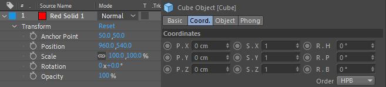

# Transformation

## Conventional, fixed UI



All applications have a UI to set a transformation (alignment) of an element. There might be some slight difference, transformation is applied in the following order: **translate**, **rotate**, **scale**. When $T$, $R$, $S$ denote transformation matrices, respectively, the final transformation matrix is

$$
M = T R S.
$$

In AfterEffects, anchor point settings are added. Nevertheless, the operation is simple; first, a translation is applied to shift the anchor point to the origin, then 3 transformations are applied, and finally the inverse translation of the first step is applied to compensate the position. With this method, rotation and scaling can be applied with respect to an arbitrary point.

$$
M = P^{-1}  (T R S) P
$$

In Houdini, the order of the multiplication of $T$, $R$, $S$ can be configured by the user.


## Stackable transfromation

As seen above, transformation itself has various ways to operate, and expressing it in a fixed UI is cumbersome. In 3D, the rotation axis order has to be considered, which creates a huge mess.

Therefore, the best UI for transformation, which I think, is a structure in which any operation can be ordered in a desired way. We call this stacking.

```cljs
(transform
 (mat2d/* (translate [50 10])
          (rotate (deg 45))
          (scale [1 1.5]))
 (guide/axis))
```

`translate`, `scale`, `rotate` are functions merely returns a matrix. By literally multiplying the return values by `mat2d/*`, a transform value can be obtained (in Lisp, namespaces are expressed by using `/`. `mat2d/*` is a multiplication `*`, a single-character function in `mat2d` namespace, a collection of 2D affine matrix operations). This is just like [CSS Transform Properties](https://developer.mozilla.org/en-US/docs/Web/CSS/transform). Therefore, if skew or translation in x-axis is needed, `skew` and `translate-x` have to be defined, respectively, to resemble CSS transform.

AfterEffects' anchor-point transformation can be defined as follows.

```cljs
;; rotation and scaling are applied
;; with respect to the pivot (20, 20),
;; the center of the square
(transform
 (mat2d/* (pivot [20 20]
                 (translate [0 0])
                 (rotate (deg 60))
                 (scale [1 1.5])))
 (style (fill "crimson")
  (rect [0 0 40 40])))
```

`pivot` function can be replaced by two translate functions:

```clojure
(mat2d/* (translate [-20 -20]) ;; move the anchor point to the origin
         (mat2d/*  (translate [0 0])
                   (rotate (deg 60))
                   (scale [1 1.5]))
         (translate [20 20])) ;; revert
```

While editing motion graphics, empty objects have to be nested in a hierarchy for a sophisticated motion that cannot be expressed by a single-layer transformation, for example, to move a shape, then to rotate and to move again. Nevertheless, Glisp allows you to achieve such an operation within a single transform UI without a redundant hierarchical structure.

Since `translate` and `mat2d/*` are simply functions that return a matrix, not only transforming an object, for example, path vertices can be transformed in the same, flexible method.

```cljs
(style (stroke "orange" 4)

 ;; path/transform is applied
 ;; not on the render context
 ;; but the path itself,
 ;; so scaling won't affect the stroke
 (path/transform
  (mat2d/* (translate [30 30])
           (rotate (deg 20))
           (scale [1 2]))

  (rect [0 0 20 20])))
```

## Constraint Operations

In addition to the basic transformations described above, there are more functions such as "following the path" and "direct to the point". These operations are often implemented as constraint operations, but every application seems to have a struggle integrating it to the transformation UI.


Stacking facilitates it, as seen before, by defining new functions, `path/align-at` and `mat2d/look-at`, respectively, which return a matrix.

```cljs
;; (def a b) to declare a variable, i.e., var a = b;
(def circle-path (circle [50 50] 36))

;; as def function also returns the assigned value,
;; with :start-sketch, only the following lines
;; are reflected in the sketch
:start-sketch

(style (stroke "skyblue")
 circle-path)

(transform
 ;; set a transformation value to follow a point
 ;; 40% from the starting point of circle-path
 (path/align-at 0.4 circle-path)

 (style (fill "crimson")
  (ngon [0 0] 10 3)))
```
