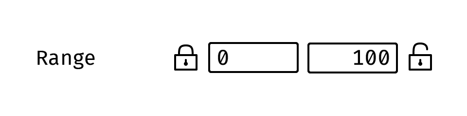
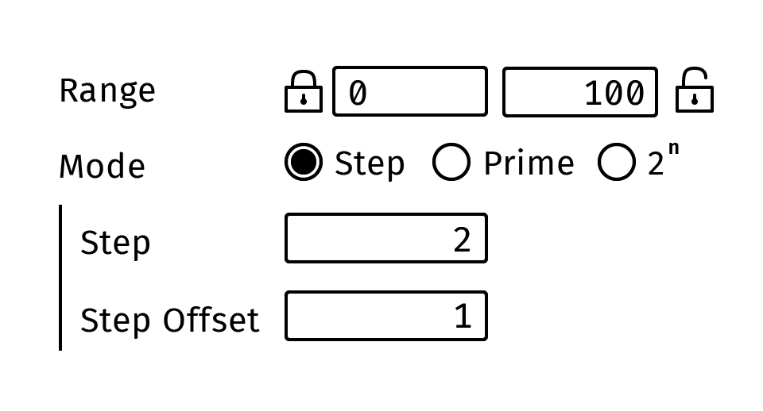
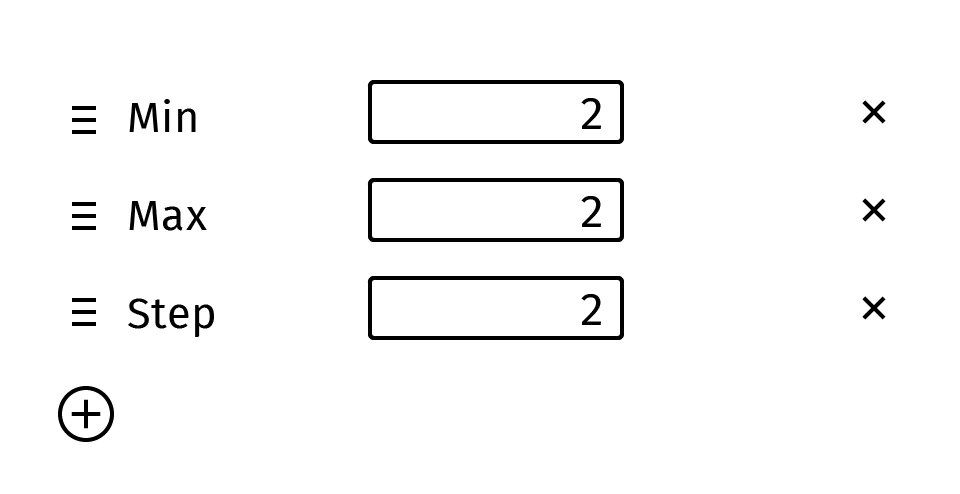

# GUIで関数を扱う

<small>※ 文章中に登場する擬似コードは、JavaScript/TypeScript/Haskell風のごちゃまぜになっています</small>

GUIベースのソフトウェアには、数値型を扱うスライダーや文字列型を扱うテキストボックスといったコンポーネントが存在しますが、**関数**をデータとして入力できるUIは殆ど見かけません。つまり、こうしたツールのGUIでは[第一級関数](https://ja.wikipedia.org/wiki/%E7%AC%AC%E4%B8%80%E7%B4%9A%E9%96%A2%E6%95%B0)を用いた高階処理は表現できないということです。多くのソフトウェア設計者は、ユーザーフレンドリーなUIに関数オブジェクトなんて抽象的で大層なものは要らないと考えがちなのですが、このことがが却ってUIを複雑奇怪なものにしてしまうことは、しばしばあります。

具体的な例として、数値スライダーのバリデーションについて考えてみます。想定されるケースとしては、デザイナーが作成したカスタムアセットのパラメーター欄を設定している時などでしょうか。スライダーを表示するには下限値と上限値が必要です。しかし範囲外の値が入力された場合、それを許容するか、あるいは範囲内に丸め込むかには選択の余地が残ります。例えば不透明度はスライダー表示も入力できる値も`0...100%`の範囲をとる必要があります。一方でブラシサイズのスライダーは、利便性を考えると`0...<キャンバス幅>px`の範囲にするのが妥当ですが、値としての上限値はありません。そうしたケースに対応するために、いくつかのソフトでは、スライダーの範囲の入力欄とは別に、その範囲外の値をそれぞれ下限値、上限値ごとに丸め込むかどうかを設定するチェック欄があったりします。

もう少しこの例を発展させてみます。例えば、オブジェクトの複製数のスライダーは非負整数になっている必要があります。そうしたバリデーションを実装するには、単に整数・実数値を切り替えるチェックボックスを加えるでも良いですが、「0.1刻みの値」「偶数」「10の倍数」などにも対応するため、より含みをもたせて**ステップ**欄を設けましょう。ステップ=0の時スライダーは実数値を取るとします。ただこの状態でバリデーションできるのは「ある実数の倍数」のみになるので、「奇数」のスライダーを表現しようとした場合、今度は**ステップのオフセット**欄が必要になります。つまりステップ=2, オフセット=1の時そのスライダーは奇数のみの入力を受け付けます。では極端な例ですが、2の累乗や、素数専用のスライダーはどうしたらいいでしょうか。そもそもスライダーがUIとして適しているかは置いといて、それぞれのモードを切り替えるラジオボタンなどが必要になるでしょう。このように、数値や文字列、真偽値といったデータしか扱えない従来のUIデザインでは、設定の細やかさを追求するほど、入力画面は複雑化していきます。

よくよく考えてみると、数値バリデーションでやっていることは「入力された数値をバリデーション後の数値へと移す」という操作にほかなりません。つまりこれは `number => number` 型の関数といえます。非負実数のバリデーションは`nonNegative = x => Math.max(x, 0)` という関数で表わせますし、整数のバリデーションは`round`関数そのものです。非負整数のバリデーションは、`round ∘ nonNegative`というバリデーション関数の合成によって表せます。もしUI上で数値や文字列、真偽値と同様に、関数を入力できるインプットがあれば、参照可能な`number => number`型の関数を好きな組み合わせで並べられる（=関数合成）UIにすることで、すべてのオプションを一同に表示せずに、かつバリデーション専用の関数を用意することなく高い柔軟度でバリデーション操作を表現することができます。

<small>注: 正確には、上のUIの各行で表現されている式は `number => number` 型の関数を返すファクトリ関数の呼び出しです。minの実装は、`min => (x => Math.max(x, min))`のような形になります。</small>

他の例でいうと、Illustratorのブレンド機能やCinema4DのMoGraphといった「繰り返し/複製処理」も、関数インプットがあるととてもシンプルなものになります。通常のUIデザインのアプローチだと、複製の種類・グリッドの間隔など、考えうるあらゆるオプションをUIに詰め込み、使用頻度の低そうなものは「詳細設定」アコーディオンで隠すといった方法をとります。一方関数オブジェクトがUI上で扱えれば、[map関数](https://developer.mozilla.org/ja/docs/Web/JavaScript/Reference/Global_Objects/Array/map)の考え方を用いて「要素のリストを生成する関数とそのパラメーター」「各要素をいかように処理していくかという関数」の2つの関数インプットを用意するだけで、そのソフトで使用可能な関数をさまざまに組み合わせることが出来ます。このように、UI上で第一級関数が扱えるということは[ツールの直行性](./orthogonality)を高め、画面のシンプルさを損なうこと無く細やかで柔軟な設定を可能にします。

---

関数オブジェクトの機能を日本語の文で雑に例えると、「〜する操作」という節を他の文章中に再帰的に埋め込めるようなものです。例えば「倍にする操作」という文から「1に『2倍にする操作』を2回行う」という文をつくることができます。この「xに『○○という操作』をN回行う」という文はそれ自体が操作であり、○○の部分に「1を足す操作」を埋めこんでも何をしても良いわけです。しかし、関数オブジェクトの無いUIで表現できる文ではこのような操作の入れ子はできず、「xをN回だけ倍にする」「xにN回だけ1を足す」という専用の操作文をそれぞれ用意してやる必要があります。両方の操作の機能を無理やり一文に詰め込むとすれば、「xをN回だけ、y倍にしてzを足す」というややこしい文章になります。ここにさらに新しい機能を加えたければ、つねにすべての機能を包括的に表す長大な操作文を用意する必要があります。しかし、操作文の入れ子が可能な場合、この中から共通する構造を「〜する操作」という節として抽出し再利用できるので、単純かつ少数の操作文をレゴブロックのように好きなように組み合わせることができます。

従来のGUIのアプローチだと、ツールにビルトインされた「操作」のxやyといったデータとしてのパラメーターだけをデザイナーがスライダー入力などを通じて調整するに留まりました。関数オブジェクトをUI上で扱えることで、操作そのものをパラメーターとして与えることができたり、操作同士を結合して新しい操作を作り出すことができるようになります。
