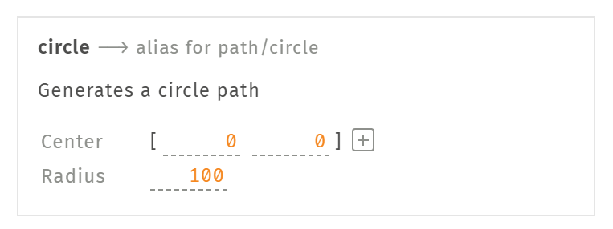

# スキーマ

Lisp は文字列としても編集できますが、インスペクタから編集することができます。例えば、円のパスを返すコードは `(circle [0 0] 100)` のようになりますが、Glisp ではこの引数部分を GUI から編集することができます。



この時、Lisp がどのように GUI コンポーネントへと変換されるかを、**スキーマ** によって設定することができます。例の circle の引数部分は、このようなスキーマ構造となっています。

```clojure
[{:label "Center" :type "vec2"}
 {:label "Radius" :type "number"}]
```

### 値

| 型  | UI  |
| --- | --- |

