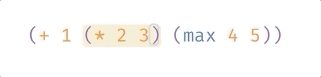

# Lisp の文法

## リストと前置記法

Glisp で使われる言語は Clojure という Lisp 方言をベースにしています。Lisp は **LIS**t **P**rocessor の略で、その名の通りその構文はリストからなります。リストは以下のように、括弧 `()` の中にスペースを挟んで表現します。カンマ `,` は要りません。

```clojure
(max 1 2 3 4) ;; 結果: 4
```

上記の `max` は、最大値を返す関数です。Lisp のリストは普通、関数呼び出しを表します。 `(<関数名> <引数1> <引数2>)` のようにリストの最初の要素が関数名、その後に続く要素がその関数への引数として解釈されます。例えば

```js
1 + 2
```

のように、2 つの値の間に挟む形で使われる足し算記号 `+` も、Lisp では `+` という名前の一介の関数でしかありません。そして、関数名は常にリストの最初に来るので、

```clojure
(+ 1 2)
```

となります。普通の関数呼び出しも同じです。

```js
Math.sqrt(4)
```

は

```clojure
(sqrt 4)
```

となります。このように、常に関数が最初に来る書き方を**前置記法**といいます。Lisp の気味悪さはだいたいこの前置記法のせいです。しかし、このシンプルさがもたらす良いこともたくさんあります。これは Lisp に慣れるうちにだんだんと分かってきます。

## すべてのリストが値を返す

このように、基本的な四則演算子をはじめ、`>` のような比較演算子、変数の宣言から条件分岐文まで、すべてが関数呼び出しの形で表現され、すべてのリストは「評価」されることでなにかかしらの値を返します。以下は JavaScript との比較例と、そのリストが返す値です。

```clojure

; 変数の宣言（右辺を返す）
; var x = 10
(def x 10) ; -> 10

; コンソールにログを表示（文全体としては nil を返す）
; console.log("Hello World")
(println "Hello World") ; -> nil

; 比較演算子（真偽値を返す）
; x == 10
(= x 10) ; -> false

; if文（三項演算子のように、if文全体としても1つの値を返す）
; (x > 5) ? "A" : "B"
(if (> x 5) "A" "B") ; -> "A"

; λ式（関数オブジェクトを返す）
; x => x * 2
(fn (x) (* x 2)) ; -> (fn (x) (x * 2))
```

## リテラル

`nil` は JavaScript でいう `null` です。Glisp では以下のようなリテラルを扱うことができます。

```clojure
-3.14159   ; 数字
"Hello"    ; 文字列
x max      ; シンボル（変数名・関数名）
:keyword   ; キーワード（マップのキーなどで使う）
true false ; 真偽値
nil        ; null

; ベクタ（関数呼び出しとは解釈されない、ただの配列データ）
[0 1 2]

; マップ
{:name "Taro" :age 20}
```

ちなみに `;` でコメントアウトできます。

## 評価

リストは入れ子にすることができます。その場合、内側かつ最初のリストから順に「評価」されます。そのリストが関数呼び出しをした結果の値に次々と置き換わっていくイメージです。以下は、式全体が評価されていく様子です。（`Ctrl+E`でカーソルがある部分の式が評価されます）



## ベクタ

カッコ `()` で囲まれたリストは常に関数呼び出しとして評価されるので、 1 つめの要素が関数ではなかった場合はエラーとなります。

```clojure
(0 1 2) ; 0 は関数ではないのでエラー
```

`[]` で囲われたリストはベクタといい、ただの配列データとして評価されるので 1 つめの要素が関数である必要はありません。Glisp では座標やパスデータを表すのに使われます。

```clojure
[50 100] ; x=50, y=100 の位置
[:path :M [0 0] :L [100 100]] ; 原点から[100 100]までの直線
```

## Clojure との違い

以上が基本的な文法になります。

より細かい構文は、[Clojure 入門](https://japan-clojurians.github.io/clojure-site-ja/guides/learn/syntax)を読んでください。

Glisp で使われる Lisp は Clojure をベースにした簡易的なものです。実装されていないコアライブラリもあります。文法としては、例えば以下のような違いがあります。

- マップは キーワードか文字列、シンボルしかキーに持つことができない
  ```clojure
  {10 "ten"} ;; だめ
  {[0 1] 100} ;; だめ
  ```
- マップの分割代入の表記順が逆
  ```clojure
  ;; Clojureでは
  (let [{x :A y :B} {:A 0 :B 1}])
  ;; Glispでは
  (let [{:A x :B y} {:A 0 :B 1}]) ;; x = 0,  y = 1
  ```
- その他 `:as` `:keys` などを使った分割代入はできない
- 名前空間の非サポート（`/` 区切りの関数名として簡易的に表記しています）
