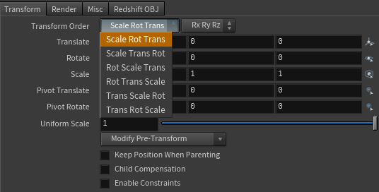

# トランスフォームについて

## 従来の固定的な UI


どのソフトにも、ある要素のトランスフォーム（配置）を設定する UI があります。多少の違いはあれ、どのソフトもおおよそ **translate（平行移動）**、**rotate（回転）**、**scale（スケール）** の順に変形が適用されるようになっています。それぞれの変形を表す行列を $T$、$R$、$S$ とし、最終的な変形行列を $M$ とすると、

$$
M = T R S
$$

のようになるということです。

AfterEffects の場合、アンカーポイントという設定項目が加わります。ただやっていること自体は簡単で、まずアンカーポイントが原点に来るよう逆方向に移動し、3 つの変形を順に適用した後、アンカーポイントの位置分だけ戻してあげるだけです。こうすることで、好きな点を基準に回転・スケールをさせることができます。

$$
M = P^{-1}  (T R S) P
$$

Houdini の場合は $T$・$R$・$S$ の適用順を自由に並べ替えることが出来ます。



## スタック式トランスフォーム

このように、トランスフォーム一つとっても様々な操作のしかたがあり、それを固定的な UI で表現しようとするとどうしても煩雑になります。3D の場合、さらに回転軸の順序も加わるので、もうシッチャカメッチャカです。

だから、僕が思うベストなトランスフォーム UI は、それぞれの変形操作を好きな順に、いくつでも並べていける構造です。これをスタック式と呼ぶことにします。

```clojure
(transform
 (mat2d/* (translate [50 100])
          (scale [1 2])
          (rotate (deg 45)))
 (guide/axis))
```

`translate`、`scale`、`rotate` は行列を返すただの関数です。それを `mat2d/*` で文字通り乗算してあげることでトランスフォーム値を得ています。（Lisp では関数名をスラッシュ`/`で区切ることで名前空間を表現します。`mat2d/*` は、2 次元のアフィン行列の操作をまとめた `mat2d` という名前空間の中の、行列の乗算をする `*` という一文字の関数名です）これはちょうど [CSS Transform プロパティ](https://developer.mozilla.org/ja/docs/Web/CSS/transform)と同じような方法です。ですから、せん断や X 軸方向だけの平行移動を表したければ、CSS に倣って`skew` や `translate-x` 関数を定義してあげるまでのことです。

AfterEffects のアンカーポイントを用いたトランスフォームは以下のように表現できます。

```clojure
(transform
 (mat2d/* (pivot [50 50]
                 (translate [50 100])
                 (scale [1 2])
                 (rotate (deg 45))))
 (guide/axis))
```

`pivot`という関数が登場していますが、上記のコードの`pivot`部分は以下と同じことです。

```clojure
(mat2d/* (translate [-50 -50]) ;; アンカーポイントを原点へ
         (mat2d/*  (translate [50 100])
                   (scale [1 2])
                   (rotate (deg 45)))
         (translate [50 50])) ;; 元に戻す
```

モーショングラフィックスの制作では、一つの図形を動かして回転させてさらにそこから動かして…といった、そのレイヤーのトランスフォームだけでは表現しきれない動かし方をするためにいくつものヌルを入れ子にすることがあります。しかしこの方法だと余計な親子関係を作らずとも、一つのトランスフォーム UI だけでそうした操作を表現することができます。

ここまでに登場した `translate` も `mat2d/*` も、行列を返すただの関数でしかないので、オブジェクトのトランスフォームに限らず、例えばパスの頂点に対する変形操作も全く同じ方法と柔軟さで表現することが出来ます。

```clojure
(style (stroke "red")

 (path/transform
  (mat2d/* (rotate 0)
           (scale [1 2]))

  (rect [0 0] [100 100])))
```

## コンストレイント機能

これまであげた基本的な変形操作の他に、「パスに沿わせる」「ある点を向く」といったものもあります。こうした操作は、コンストレイント（拘束）機能として実装されていることが多いですが、どのソフトもトランスフォーム UI と統合するのに苦労しているようです。


スタック式だと、これまでと同様、新しい行列 `path/align-at` や `mat2d/look-at` を定義するだけでコトは済みます。

```clojure

```
